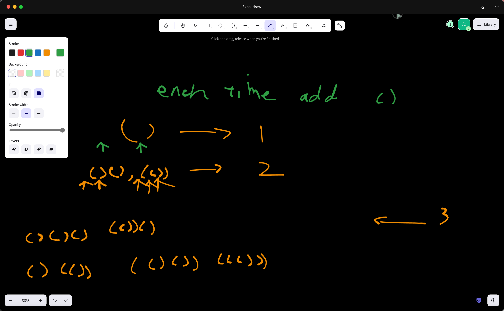

# 22 Generate Parentheses

[22. Generate Parentheses](https://leetcode.com/problems/generate-parentheses/)

Given `n` pairs of parentheses, write a function to _generate all combinations of well-formed parentheses_.

&#x20;

**Example 1:**

<pre><code><strong>Input: n = 3
</strong><strong>Output: ["((()))","(()())","(())()","()(())","()()()"]
</strong></code></pre>

**Example 2:**

<pre><code><strong>Input: n = 1
</strong><strong>Output: ["()"]
</strong></code></pre>

&#x20;

**Constraints:**

* `1 <= n <= 8`


<figure><figcaption><p>self proposed</p></figcaption></figure>



```python
class Solution:
    def generateParenthesis(self, n: int) -> List[str]:
        if n == 1:
            return ['()']
        result_pres = self.generateParenthesis(n - 1)
        ans = []
        for result_pre in result_pres:
            for i in range(len(result_pre)):
                new_result = result_pre[0:i] + '()' + result_pre[i:len(result_pre)]
                ans.append(new_result)
                if result_pre[i] == ')':
                    break
        return ans
```



```python
class Solution:
    def generateParenthesis(self, n: int) -> List[str]:
        ans = []

        def dfs(n, string_list, left_count, right_count):
            if left_count + right_count == n * 2:
                nonlocal ans
                ans.append("".join(string_list))
            
            if left_count < n:
                string_list.append('(')
                dfs(n, string_list, left_count + 1, right_count)
                string_list.pop()

            if right_count < left_count:
                string_list.append(')')
                dfs(n, string_list, left_count, right_count + 1)
                string_list.pop()

            
        dfs(n, [], 0, 0)
        return ans
```



